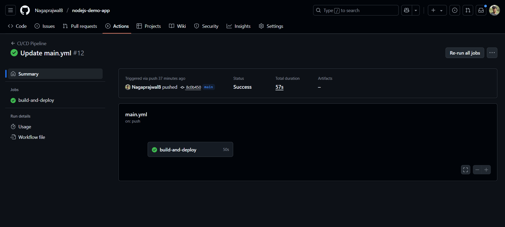

## Node.js Demo App with CI/CD Pipeline using GitHub Actions and Docker

[](https://github.com/NagaprajwalB/nodejs-demo-app/actions)

[](https://hub.docker.com/r/prajjub/node-app)

* This repository sets up a CI/CD pipeline for a Node.js web app using GitHub Actions and Docker.
* The pipeline automates the process of testing, building, and deploying the application by pushing a Docker image to DockerHub.

### Repository
This pipeline example uses the sample Node.js app from:
```
https://github.com/NagaprajwalB/nodejs-demo-app.git
```
### ✨Features
* **Automated Testing :** Jest/Mocha tests run on every push
* **Docker Build :** Containerization with multi-stage builds
* **Self-Hosted Deployment :** Runs on your local machine
* **No Cloud Required:** Entire pipeline executes locally
* **Real-time Monitoring:** Dashboard shows deployment status

### Prerequisites
| Component             | Technology                          |
|-----------------------|-------------------------------------|
| CI/CD Pipeline        | GitHub Actions                      |
| Containerization      | Docker                              |
| Web Framework         | Node.js + Express                   |
| Testing Framework     | Jest                                |
| Deployment Target     | DockerHub                           |

### 📁 Repository Structure
```
nodejs-demo-app/
│
├── .github/
│   └── workflows/
│       └── main.yml       # GitHub Actions CI/CD workflow
├── app.js                 # Sample Node.js app entry point
├── Dockerfile             # Docker image build instructions
├── package.json           # Node.js project description and dependencies
└── README.md              # This readme file
```
### GitHub Actions Workflow (main.yml)

The workflow `.github/workflows/main.yml` includes these jobs:

**1. Test :** Runs npm install and tests the Node.js app

**2. Build :** Uses Docker to build an image for the app

**3. Deploy :** Pushes the built Docker image to DockerHub

Pipeline triggers on every push to the main branch.

**Pipeline Workflow** : `https://github.com/NagaprajwalB/nodejs-demo-app/actions`




## Setup Instructions
1. Fork or clone the sample Node.js app repository.

2. Add the .github/workflows/main.yml file with the pipeline configuration.

3. In your GitHub repo, configure the following secrets:

   * `DOCKERHUB_USERNAME` - your DockerHub username

   * `DOCKERHUB_TOKEN` - your DockerHub access token

4. Modify main.yml to specify your DockerHub repo name for image tagging and pushing.

5. Commit and push changes to the main branch.

6. Check the Actions tab in GitHub to monitor your pipeline execution.

### Notes
* Ensure your Node.js app has defined test scripts in package.json to enable automated testing.

* Docker image tags are based on the GitHub commit SHA for traceability.

* This pipeline can be enhanced further to deploy the app to Kubernetes, AWS, or other platforms.